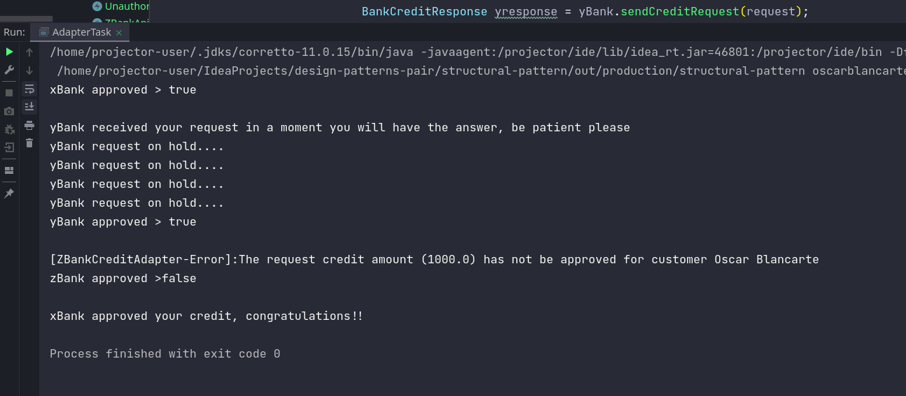

# 

<a>

</a>

# Tarea de Patrones Estructurales

**Integrantes:**

* Bryam David Vega Moreno

* Pablo Sebastian Calderon Maldonado

**Repositorio:** [design-patterns-pair/structural-pattern at main · pscalderonm/design-patterns-pair · GitHub](https://github.com/pscalderonm/design-patterns-pair/tree/main/structural-pattern)

-------------------

## Patron Adapter

> "Usando el patrón Adapter, agregar un tercer banco llamado ZBank que
tenga una respuesta síncrona, el API deberá regresar verdadero
cuando se le autorice el crédito, pero deberá lanzar una excepción
cuando el crédito no sea autorizado."

### Solucion del problema

1. Se procede creando las clases que representan al servicio del ZBank. `UnauthorizedCreditException` representa la respuesta del servicio cuando el credito no fue aprobado.

**ZBankCreditRequest**
``` java
package oscarblancarte.ipd.adapter.creditapi.bankz;

import java.math.BigDecimal;

public class ZBankCreditRequest {
    private String customer;
    private BigDecimal amount;

    public String getCustomer() {
        return customer;
    }

    public void setCustomer(String customer) {
        this.customer = customer;
    }

    public BigDecimal getAmount() {
        return amount;
    }

    public void setAmount(BigDecimal amount) {
        this.amount = amount;
    }
}
```

**UnauthorizedCreditException**

``` java
package oscarblancarte.ipd.adapter.creditapi.bankz;

import java.math.BigDecimal;

public class UnauthorizedCreditException extends Exception {

    public UnauthorizedCreditException(String customer, BigDecimal amount){
        super(String.format("The request credit amount (%s) has not be approved for customer %s",
                amount.toString(), customer));
    }
}
```

**ZBankApiClient**

Es donde la lógica del servicio de tercero se ejecuta para evaluar el crédito.
``` java
package oscarblancarte.ipd.adapter.creditapi.bankz;

import java.math.BigDecimal;

public class ZBankApiClient {

    private static final BigDecimal MAX_CREDIT_AMOUNT = new BigDecimal(100);

    public boolean requestCreditApproval(ZBankCreditRequest request) throws UnauthorizedCreditException {

        if(request.getAmount().compareTo(MAX_CREDIT_AMOUNT)> 0)
            throw new UnauthorizedCreditException(request.getCustomer(), request.getAmount());

        return true;
    }
}
```
2. Definimos el nuevo adapter que va a interactuar con el servicio del ZBank. Internamente se controla la excepción basada en regla de negocio que puede ser lanzada si la regla (aprobación de crédito) no se cumple.

**ZBankCreditAdapter**
``` java
package oscarblancarte.ipd.adapter.impl;

import oscarblancarte.ipd.adapter.creditapi.bankz.UnauthorizedCreditException;
import oscarblancarte.ipd.adapter.creditapi.bankz.ZBankApiClient;
import oscarblancarte.ipd.adapter.creditapi.bankz.ZBankCreditRequest;

import java.math.BigDecimal;

public class ZBankCreditAdapter implements IBankAdapter {

    @Override
    public BankCreditResponse sendCreditRequest(BankCreditRequest request) {

        ZBankCreditRequest zRequest = new ZBankCreditRequest();
        zRequest.setCustomer(request.getCustomer());
        zRequest.setAmount(BigDecimal.valueOf(request.getAmount()));

        ZBankApiClient apiClient = new ZBankApiClient();
        BankCreditResponse response = new BankCreditResponse();
        try{
            response.setApproved(apiClient.requestCreditApproval(zRequest));

        }catch(UnauthorizedCreditException uex){
            System.out.printf("[ZBankCreditAdapter-Error]:%s%n", uex.getMessage());
            response.setApproved(false);
        }

        return response;
    }
}
```

3. Por último, se llama al nuevo adapter en la clase `Main` para ejecutarlo `line 25 to 27`

``` java
BankAdapter zBank = new ZBankCreditAdapter();
BankCreditResponse zresponse = zBank.sendCreditRequest(request);
System.out.println("zBank approved >" + zresponse.isApproved() + "\n");
```

### Resultado Obtenido

Se simula la llamada al ZBank, obteniendo como respuesta una excepción, la misma que es controlada dentro del Adapter y presentada a modo de log en consola. Al final el resultado devuelveto es el objeto `BankCreditResponse` con su propiedad `approved` en false



## Patron Decorator
TODO: Complete...

### Solucion del problema

TODO: Complete...